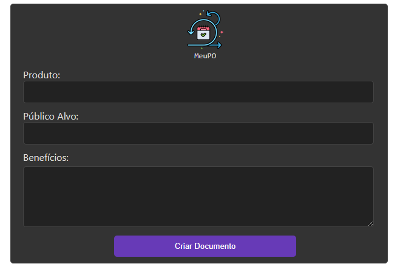

## MeuPO: O Bot Product Owner que Agiliza seu Trabalho!

**Automatize tarefas, gere documentos, desenvolva e priorize ideias com praticidade e eficiência.**

**Teste agora**: [MeuPO](https://meu-po.vercel.app/)

O MeuPO está hospedado na Vercel em [meu-po.vercel.app](https://meu-po.vercel.app/), foi desenvolvido em JavaScript e Next.js e utiliza a API do Google Gemini para auxiliar no trabalho de um Product Owner ou de quem precisava de um 😅.
O MeuPO agiliza diversos processos essenciais para gerenciamento de produto, incluindo:

**Processos Disponíveis:**

- **Criar documento de Visão do Produto:** Gere um documento completo com os principais elementos da visão do produto, como objetivos, personas, proposta de valor e roadmap.
- **Fazer o Levantamento de Requisitos:** Colete e organize os requisitos do produto de forma eficiente, categorizando-os em funcionalidades, necessidades e critérios de aceitação.
- **Histórias de Usuários:** Crie histórias de usuários claras e concisas que descrevem as funcionalidades do produto do ponto de vista do usuário.
- **Histórias de Usuários Priorizadas:** Priorize as histórias de usuários com base em critérios predefinidos, como valor para o negócio, impacto nos usuários e esforço de desenvolvimento.
- **Backlog do Produto:** Organize o backlog do produto com todas as tarefas pendentes, incluindo descrição, estimativa de tempo e prioridade.
- **Lista de Itens do Backlog:** Gere uma lista completa dos itens do backlog do produto, com informações como título, descrição e status.
- **Detalhar Tarefas do Backlog:** Obtenha detalhes completos de cada tarefa do backlog, incluindo descrição, estimativa de tempo, prioridade, dependências e status.
- **Criar testes das tarefas do backlog:** Crie testes automatizados para as tarefas do backlog, garantindo a qualidade do software e a entrega de valor ao cliente.

**Funcionalidades Adicionais:**

- **Salvamento em PDF:** Salve cada resultado de cada processo em formato PDF para consulta posterior ou compartilhamento com stakeholders.
- **Interface amigável:** O MeuPO oferece uma interface amigável e intuitiva, facilitando o uso para Product Owners de todos os níveis de experiência.
- **Ajuste se necessário:** O MeuPO foi desenvolvido de maneira a permitir que você adicione ou remova trechos da resposta diretamente no TextArea antes de ir para o próximo processo.

**Visão Geral da Interface:**

- **Tela Inicial**
  &nbsp;
  

- **MeuPO em execução**
  &nbsp;
  

**Requisitos para Execução:**

- Node.js instalado na sua máquina local
- Conta Google Cloud Platform
- API do Google Gemini ativada

**Para Começar:**

1. Clone este repositório em sua máquina local.
2. Instale as dependências do projeto: `npm install`.
3. Edite a variável `NEXT_PUBLIC_GEMINI_API_KEY` do arquivo `.env.development`
4. Execute o projeto: `npm run dev`.
5. Acesse o MeuPO em seu navegador web.

**Contribuições:**

- Se você tiver sugestões ou melhorias para o MeuPO, sinta-se à vontade para contribuir com o projeto.

**Agradecimentos:**

- Agradeço a equipe do [Google Gemini](https://gemini.google.com/app) por fornecer a API que torna o MeuPO possível.

- Agradeço a equipe [Alura](https://www.alura.com.br/) pela 2ª edição da Imersão IA em parceria com o Google.

- Agradeço a equipe da [FIAP](https://www.fiap.com.br/) por toda contribuição.

- Agradeço especialmente ao **Fabrício Carraro**, **Paulo Silveira**, **Ana Raquel** e **Luciano Martins**.

Por fim, agradeço a todos que compartilharam seu conhecimento e tempo nesta imersão, vocês são D+.

**Disclaimer:**

- O MeuPO é um projeto de autoria própria, desenvolvido para o desafio da Imersão IA 2024 da Alura em parceria com o Google e não é um produto oficial do Google ou da Alura.

_by: Jefferson Ferreira_
